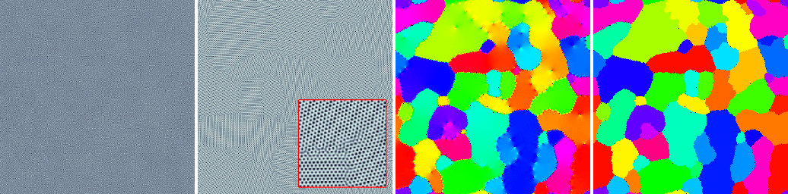
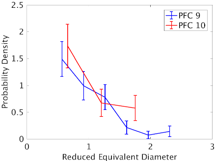

# PFC-GEM

> Phase-Field-Crystal Grain Extraction and Measurement

For appropriate choices of input parameters, Phase-Field-Crystal (PFC) simulations produce atom-like patterns that arrange into grains similar to those observed in polycrystalline materials. This project contains MATLAB code to run the PFC flow, find and color grains then measure their geometric properties.

These tools are provided as-is.

**Tools**
- `PFC-GEM/EvolvePFC` implements the unconditionally stable PFC scheme from [A simple and efficient scheme for Phase Field crystal simulation](https://www.esaim-m2an.org/articles/m2an/abs/2013/05/m2an130074/m2an130074.html) by Elsey and Wirth.

- `PFC-GEM/AtomicPositions` extracts atomic positions from the phase fields generated in PFC simulations.

- `PFC-GEM/AtomsToStats` implements the grain extraction and measurement procedure from [Atom based grain extraction and measurement of geometric properties](https://iopscience.iop.org/article/10.1088/1361-651X/aaa635). The method supports the extraction of grains from a distribution of atomic positions (for example, once obtained from PFC simulations). Computed geometry includes grain orientation, area, perimeter and convex hull area. It also outputs an adjacency matrix for neighbor grains, grain to grain interface length and misorientation, allowing the computation of the Grain Boundary Character Distribution.

- `PFC-GEM/GrainAnalysis` collects the extracted grain properties and prepares plots of the various statistical distributions. Such tools were used in preparing the comparison plots in [Statistics of grain growth: Experiment versus the Phase-Field-Crystal and Mullins models](https://www.sciencedirect.com/science/article/pii/S2589152919300766).

The method assumes the PFC domain is a square with periodic boundary conditions, but rectangular domains can be implemented by modifying the domain definition in `PFC_Evolution.m`. In addition, some assumptions such as the domain area being L2 must be revised in the other tools.

**Test script**

Run `PFC-GEM/Test.m` for an example of the complete workflow. The picture below illustrates the process to identify grains from a PFC simulation with a random initial condition.

The regions in the last pictures can be measured to extract comparisons similar to the following.

**Direct links for the cited papers**
- [PFC scheme](https://www.uni-muenster.de/AMM/num/wirth/files/ElWi12.pdf)

- [PFC grain extraction and measurement](http://www.math.mcgill.ca/rchoksi/pub/grain1.pdf)

- [PFC statistics and comparison to experimental data](http://www.math.mcgill.ca/rchoksi/pub/PFC.pdf)
